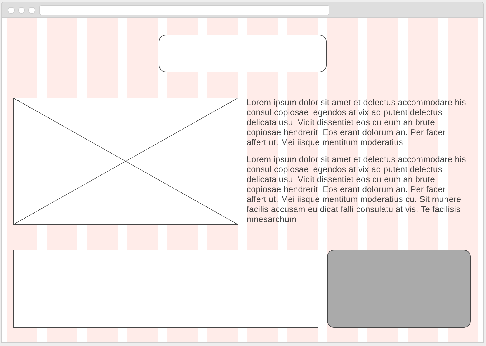
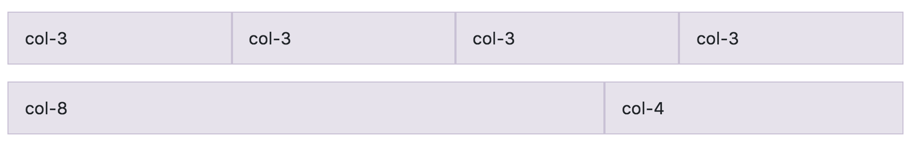

# Implementing Bootstrap

## What is Bootstrap?

Bootstrap is a library (like an add-on or expansion back) to HTML, CSS, and Javascript, that adds in a lot of functionality that many web designers wish existed automatically.

In particular, it can be really hard to make elements line up on a page the way you want them to, and even worse when you try to pull up the same page on screens that are really small (like a cell phone) and screens that are really large (like an apple TV connected to an HD monitor).

All of this will make more sense once we start going, so we're going to jump right in.

Open up a preview of the index.html file. you'll see a lot of filler text there. It should look pretty plain, and it's really just so we can see whether our linked Bootstrap is working - we'll delete these elements later.

## Review

Before we start, let's remind ourselves how to connect a stylesheet to an HTML page. You'll need a link tag connecting our `style.css` file. It will look like this:

```html
<link rel="stylesheet" href="style.css">
```

This stylesheet has one selector already written that adds margins to rows. Ignore that for now - we'll get to it in a moment.

## 1. Linking Bootstrap

Since the entire Bootstrap library has already been written by someone else, we're going to copy paste this code and get Bootstrap through a CDN (a Content Delivery Network). In other words, we'll tell a browser visiting our site where it can find the Bootstrap library, rather than hosting a copy of the library ourselves.

We'll do this using the same link tags we've been using to link css files, but instead of using local filepaths, we'll instruct a browser to look elsewhere for the Bootstrap css.

You can find the link tags we need in the Quick Start section of the <a href="https://getbootstrap.com/docs/4.0/getting-started/introduction/">Bootstrap documentation</a>.

You'll notice that there are also three `<script>` tags in there as well. We'll link the stylesheet in the head of our HTML document, but we'll load in these scripts down at the bottom (right before the `</body>` tag) because they take longer, and we won't need them until after our page is already loaded.

Here's what these links and scripts look like when they're pasted in correctly:

```html
<!DOCTYPE html>
<html>
  <head>
    <meta charset="utf-8">
    <title>A Test Bootstrap Page</title>
    <link rel="stylesheet" href="style.css">
    <link rel="stylesheet" href="https://maxcdn.bootstrapcdn.com/bootstrap/4.0.0-beta/css/bootstrap.min.css" integrity="sha384-/Y6pD6FV/Vv2HJnA6t+vslU6fwYXjCFtcEpHbNJ0lyAFsXTsjBbfaDjzALeQsN6M" crossorigin="anonymous">
  </head>
  <body>
    <h1>Test Heading!</h1>
    <p>Lorem ipsum dolor sit amet, consectetur adipisicing elit, sed do eiusmod tempor incididunt ut labore et dolore magna aliqua. Ut enim ad minim veniam, quis nostrud exercitation ullamco laboris nisi ut aliquip ex ea commodo consequat. Duis aute irure dolor in reprehenderit in voluptate velit esse cillum dolore eu fugiat nulla pariatur. Excepteur sint occaecat cupidatat non proident, sunt in culpa qui officia deserunt mollit anim id est laborum.</p>
    <script src="https://code.jquery.com/jquery-3.2.1.slim.min.js" integrity="sha384-KJ3o2DKtIkvYIK3UENzmM7KCkRr/rE9/Qpg6aAZGJwFDMVNA/GpGFF93hXpG5KkN" crossorigin="anonymous"></script>
    <script src="https://cdnjs.cloudflare.com/ajax/libs/popper.js/1.11.0/umd/popper.min.js" integrity="sha384-b/U6ypiBEHpOf/4+1nzFpr53nxSS+GLCkfwBdFNTxtclqqenISfwAzpKaMNFNmj4" crossorigin="anonymous"></script>
    <script src="https://maxcdn.bootstrapcdn.com/bootstrap/4.0.0-beta/js/bootstrap.min.js" integrity="sha384-h0AbiXch4ZDo7tp9hKZ4TsHbi047NrKGLO3SEJAg45jXxnGIfYzk4Si90RDIqNm1" crossorigin="anonymous"></script>
  </body>
</html>
```

Refresh your preview of index.html, and you should see some of Bootstrap's default styles starting to make your page look a little less "1993" and a bit cleaner and more modern.  

## 2. The Grid

### Your Vision

Bootstrap becomes more useful the more carefully _you've_ planned your website. Before we can explain the grid, you need to have something worth building on the grid.

Take some time and sketch out a website. Here's one that was mocked up in a really basic painting utility called <a href="https://wireframe.cc/">wireframe.cc</a>.



Looking at this mockup, we can see three apparent rows. The first row has only one item in it, and the second two rows each have two items in them.

The middle row has two equally sized items (or columns), and the last row has two columns as well, but the left column is about two-thirds of the width of the page, and the right column is about one-third of the width of the page.

#### The Container

In order to make this look good in a browser, we'll start with a Bootstrap class of a div called a `container`. A div (division) is an element used a lot in Bootstrap. They function essentially like invisible boxes, so you can't see them, but they help hold other visible elements in place. We'll do ALL our code for our website inside this `container` class div.

```html
<body>
  <div class="container">

  </div>

  <script src="https://code.jquery.com/jquery-3.2.1.slim.min.js" integrity="sha384-KJ3o2DKtIkvYIK3UENzmM7KCkRr/rE9/Qpg6aAZGJwFDMVNA/GpGFF93hXpG5KkN" crossorigin="anonymous"></script>
  <script src="https://cdnjs.cloudflare.com/ajax/libs/popper.js/1.11.0/umd/popper.min.js" integrity="sha384-b/U6ypiBEHpOf/4+1nzFpr53nxSS+GLCkfwBdFNTxtclqqenISfwAzpKaMNFNmj4" crossorigin="anonymous"></script>
  <script src="https://maxcdn.bootstrapcdn.com/bootstrap/4.0.0-beta/js/bootstrap.min.js" integrity="sha384-h0AbiXch4ZDo7tp9hKZ4TsHbi047NrKGLO3SEJAg45jXxnGIfYzk4Si90RDIqNm1" crossorigin="anonymous"></script>
</body>
```

Next, since we know we'll have three rows, let's put three classes of divs called `row` inside our container. I'm going to comment at the end of each row so we know where those rows end.

```html
<div class="container">
  <div class="row">

  </div>
  <!-- end of row 1 -->
  <div class="row">

  </div>
  <!-- end of row 2 -->
  <div class="row">

  </div>
  <!-- end of row 3 -->
</div>
```

#### Row 1

Now it's time to build out each row. Let's start with the first row. It only has one column, but importantly, that column is centered, so we're going to create a div with two classes - it's both a column and a centered element.

```html
<div class="row">
  <div class="col text-center">
    <h1>Sample Title</h1>
  </div>
</div>
<!-- end of row 1 -->
```

The space between the classes `col` and `text-center` allow us to assign two classes to this div - this div is both things at once.

You'll notice that we added an h1 element in the div, That's so we can see it. Without that element, the column would be there, but it would be invisible - a column is really just another sort of container.

BONUS: There's also another way to center an element (not just the text inside of it), so if you're interested, look at the <a href="https://getbootstrap.com/docs/4.0/layout/grid/#horizontal-alignment">horizontal alignment</a> section of the Bootstrap documentation.

#### Row 2

Moving on to the second row, we know there are two columns. Here's what that will look like:

```html
<div class="row">
  <div class="col">
    Lorem ipsum dolor sit amet, consectetur adipisicing elit, sed do eiusmod tempor incididunt ut labore et dolore magna aliqua. Ut enim ad minim veniam, quis nostrud exercitation ullamco laboris nisi ut aliquip ex ea commodo consequat. Duis aute irure dolor in reprehenderit in voluptate velit esse cillum dolore eu fugiat nulla pariatur. Excepteur sint occaecat cupidatat non proident, sunt in culpa qui officia deserunt mollit anim id est laborum.
  </div>
  <div class="col">
    Lorem ipsum dolor sit amet, consectetur adipisicing elit, sed do eiusmod tempor incididunt ut labore et dolore magna aliqua. Ut enim ad minim veniam, quis nostrud exercitation ullamco laboris nisi ut aliquip ex ea commodo consequat. Duis aute irure dolor in reprehenderit in voluptate velit esse cillum dolore eu fugiat nulla pariatur. Excepteur sint occaecat cupidatat non proident, sunt in culpa qui officia deserunt mollit anim id est laborum.
  </div>
</div>
<!-- end of row 2 -->
```

As before, we need to put something inside those columns for the time being. We're using lorem text - latin filler that we can replace with our website's actual content later.

#### Row 3

This third row will be trickier, You may have noticed that when we assign divs in a row the class of `col`, the row automatically splits the row equally. That's great, but it's not what we want here.

If you want to force uneven distribution of columns, it's easy. Just make sure they add up to twelve.



You can see that if you want four equal columns, you'd make each one a col-3, because 3 + 3 + 3 + 3 = 12. The second example has one large column and one small column, and 8 + 4 = 12 as well, so that should work!

Here's what this will look like in our code:

```html
<div class="row">
  <div class="col-8">
    Lorem ipsum dolor sit amet, consectetur adipisicing elit, sed do eiusmod tempor incididunt ut labore et dolore magna aliqua. Ut enim ad minim veniam, quis nostrud exercitation ullamco laboris nisi ut aliquip ex ea commodo consequat. Duis aute irure dolor in reprehenderit in voluptate velit esse cillum dolore eu fugiat nulla pariatur. Excepteur sint occaecat cupidatat non proident, sunt in culpa qui officia deserunt mollit anim id est laborum.
  </div>
  <div class="col-4">
    Lorem ipsum dolor sit amet, consectetur adipisicing elit, sed do eiusmod tempor incididunt ut labore et dolore magna aliqua. Ut enim ad minim veniam, quis nostrud exercitation ullamco laboris nisi ut aliquip ex ea commodo consequat. Duis aute irure dolor in reprehenderit in voluptate velit esse cillum dolore eu fugiat nulla pariatur. Excepteur sint occaecat cupidatat non proident, sunt in culpa qui officia deserunt mollit anim id est laborum.
  </div>
</div>
<!-- end of row 3 -->
```

Now we can go back in and replace this lorem text with images, lists, contact information, or whatever else we know will be relevant on our website.

## 3. Bootstrap Built-in Classes

Bootstrap automatically styles a lot for us - we see that in action already. But there are hundreds of other options you can implement based on what you're going for.

For example, look at this example of muted secondary <a href="https://getbootstrap.com/docs/4.0/content/typography/#customizing-headings">heading text</a>.

There's also some really beautiful styling built in for <a href="https://getbootstrap.com/docs/4.0/content/typography/#blockquotes">blockquotes</a>.

These are all from the typography section, but the content and components section on the left let us see a ton of built-in options for almost anything you might choose to implement on your website. Use the search bar to figure out what else you might try to make.

Here are some ideas you could research and try implementing:

* buttons
* cards
* navbars
* collapsible elements
* forms
* carousels
